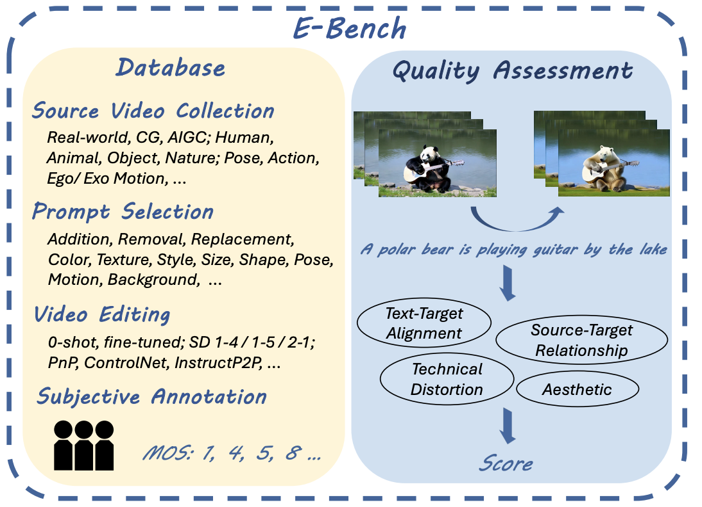
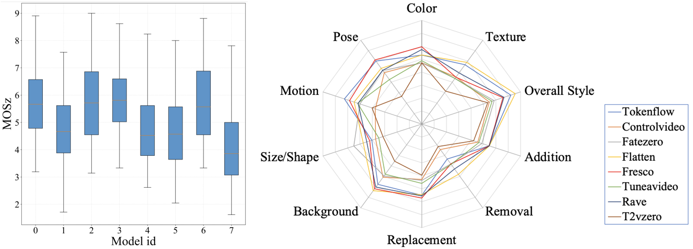

# [E-Bench: Subjective-Aligned Benchmark Suite for Text-Driven Video Editing Quality Assessment](https://arxiv.org/abs/2408.11481)

<div align="center">
Shangkun Sun, Xiaoyu Liang, Songlin Fan, Wenxu Gao, Wei Gao* <br>

(* Corresponding author)<br>

from MMCAL, Peking University
</div>

<div align="center">
<video src="assets/demo.mp4"></video>
</div>

## 🎦 Introduction
TL;DR: E-Bench is an evaluation suite for text-driven video editing, consisting of a quality assessment model to provide a human-aligned metric for edited videos, and a database containing rich video-prompt pairs and the corresponding human scores.

<div align="center">

<br>
Overview of the E-Bench Suite
</div>

E-Bench DB contains a rich collection of source videos, including real-world videos, AIGC videos, and CG videos, covering various aspects such as people, objects, animals, and landscapes. It also includes a variety of editing instructions across different categories, including semantic editing like addition, removal, replacement, etc., as well as structural changes in size, shape, etc., and stylizations such as color, texture, etc. Additionally, it features editing results based on different video editing models. We conducted a subjective experiment involving 24 participants from diverse backgrounds, resulting in 28,080 score samples. We further trained E-Bench QA model based on this data. The left image below shows the box plot of average scores obtained by each model during the subjective experiment, while the right image illustrates the scores for each model across different types of prompts.

<div align="center">

<br>
Left: Average score distributions of 8 editing methods. &emsp; &emsp; Right: Performance on different types of prompts from previous video-editing methods.
</div>

## 💼 Model Preparation
Download all models from [google drive](https://drive.google.com/drive/folders/1kD82Ex90VP9A_AqjYV1J5DYvBQW-hkXa?usp=sharing) and put them into ``ckpts``.

## ✨ Usage
### Evaluate one single video
```
python infer.py --single_test --src_path ${path_to_source_video} --dst_path ${path_to_dst_video} --prompt ${editing_prompt}

# Run on example videos
# python infer.py --single_test --src_path "./data/src/00433tokenflow_baby_gaze.mp4" --dst_path "./data/edited/00433tokenflow_baby_gaze.mp4" --prompt "A black-haired boy is turning his head" 
```


### Evaluate a set of videos
```
python infer.py --data_path ${path_to_data_folder} --label_path ${path_to_prompt_txt_file}
```

## 🙏 Acknowledgements
Part of the code is developed based on [DOVER](https://github.com/VQAssessment/DOVER) and [BLIP](https://github.com/salesforce/BLIP). We would like to thank the authors for their contributions to the community.


## 📭 Contact
If your have any comments or questions, feel free to contact [sunshk@stu.pku.edu.cn](lsunshk@stu.pku.edu.cn).


## 📖 BibTex
```bibtex
@article{sun2024bench,
  title={E-Bench: Subjective-Aligned Benchmark Suite for Text-Driven Video Editing Quality Assessment},
  author={Sun, Shangkun and Liang, Xiaoyu and Fan, Songlin and Gao, Wenxu and Gao, Wei},
  journal={arXiv preprint arXiv:2408.11481},
  year={2024}
}
```
